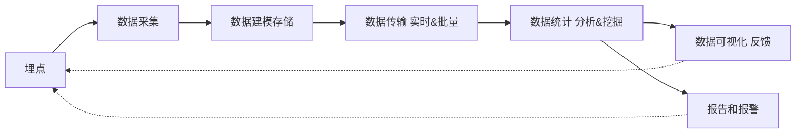

# 前端监控

## 1.前端监控的原因

- 更快发现问题和解决问题
- 做产品的决策依据
- 提升前端工程师的技术深度和广度，打造建立亮点
- 为业务扩展提供更多可能性

## 2.前端监控目标

1. 稳定性 stability

| 错误名称 | 备注                         |
| -------- | ---------------------------- |
| js 错误  | js 执行错误或者 promise 异常 |
| 资源错误 | script、link 等资源加载异常  |
| 接口错误 | ajax 或 fetch 请求接口异常   |
| 白屏     | 页面空白                     |

2. 用户体验 experience

| 名称                                      | 备注                                                         |
| ----------------------------------------- | ------------------------------------------------------------ |
| 加载时间                                  | 各个阶段的加载时间                                           |
| TTFB(time to first byte)首字节时间        | 浏览器发起第一个请求到数据返回第一个字节所消耗的时间，这个时间包含了网络请求时间、后端处理时间 |
| FP(First Paint)首次绘制                   | 包括任何用户自定义的背景绘制，它是将第一个像素点绘制到屏幕的时刻 |
| FCP(First Content Paint)首次内容绘制      | 浏览器将第一个 DOM 渲染到屏幕的时间，可以是任何文本、图像、SVG 等内容的时间 |
| FMP(First Meaningful Paint)首次有意义绘制 | 是页面可用性的量度标准                                       |
| FID(First Input Delay)首次输入延迟        | 用户首次和页面交互到页面响应交互的时间                       |
| 卡顿                                      | 超过 50ms 的长任务                                           |

3. 业务 business

| 名称           | 备注                             |
| -------------- | -------------------------------- |
| PV             | page view 页面浏览量或点击量     |
| UV             | 访问某个站点的不同 IP 地址的人数 |
| 页面的停留时间 | 用户在每一个页面的停留时间       |

## 3.前端监控流程

- 前端埋点
- 数据上报
- 分析和计算 将采集道德数据进行加工汇总
- 可视化展示 将数据按各种维度进行展示
- 监控报警 发现问题后按一定的条件触发报警

前端需要关注的：埋点、数据采集

### 常见的埋点方案

1. 代码埋点

- 以嵌入代码的形式进行埋点，比如需要监控用户的点击事件，会选择在用户点击是，插入一段代码，保存这个监听行为或者直接将监听行为以某一种数据格式直接传递给服务器端
- 优点：可以在任意时刻，精确的发送或保存所需要的数据信息
- 缺点：工作量较大

2. 可视化埋点

- 通过可视化交互的手段，代替代码埋点
- 将业务代码和埋点代码分离，提供一个可视化交互的页面，输入为业务代码，通过这个可视化系统，可以在业务代码中自定义的增加埋点事件等等，最后数据的代码耦合了业务代码和埋点代码
- 可视化埋点就是用系统来代替手工插入埋点代码

3. 无痕埋点

- 前端的任意一个事件都被绑定一个标识，所有的事件都被记录下来
- 通过定期上传记录文件，配合文件解析，解析出来想要的数据，生成可视化报告供专业人员分析
- 优点：采集全量数据，不会出现漏埋和误埋等现象
- 缺点：给数据传输和服务器增加压力，也无法灵活定制数据结构

## 4.编写监控采集脚本

### 开通日志服务

- 日志服务（Log Service 简称 SLS）是针对日志类数据一站式服务，用户无需开发就能快捷完成数据采集、消费、投递以及查询分析等功能，帮助提升运维、运营效率，建立 DT 时代海量日志处理能力
- 日志服务帮助文档
- Web Tracking

### 监控错误

#### 错误分类

- JS 错误
  - JS 错误
  - Promise 异常
- 资源异常
  - 监听 error

#### 数据结构设计

